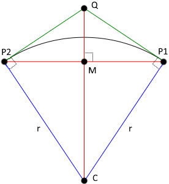
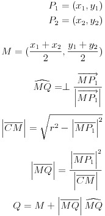

# drawArc

**Draws an arc of a given radius between two points**

Typically, the HTML canvas `arcTo` method is used to draw rounded corners and determining the values of the parameters is generally trivial because the first endpoint is simply the corner. However, computing the first endpoint in the case of drawing a generic arc is complicated. The `drawArc` method does that computation for you.

## The Math

Given a starting point, *P1*, an endpoint, *P2*, and a radius, *r*, compute a point, *Q*, such that *P1Q* and *P2Q* are tangent at *P1* and *P2* to a circle with the given radius with *P2* counter-clockwise from *P1*.

<!--
P_{1} = ( x_{1} , y_{1} ) \\
P_{2} = ( x_{2} , y_{2} ) \\ \\
M = ( \frac{ x_{1} + x_{2} }{2} , \frac{ y_{1} + y_{2} } {2}) \\ \\
\widehat{MQ} = \perp \frac { \overrightarrow{MP_{1}} } { \left | \overrightarrow{MP_{1}} \right | } \\ \\
\left | \overline{CM} \right | = \sqrt{ r^2 - \left | \overline{MP_{1}} \right |^2 } \\ \\
\left | \overline{MQ} \right | = \frac { \left | \overline{MP_{1}} \right |^2 } { \left | \overline{CM} \right | } \\ \\
Q = M + \left | \overline{MQ} \right | \widehat{MQ}
-->

## API

drawArc(context, x1, y1, x2, y2, radius)

 * **context** - HTML drawing context
 * **x1, y1** - start of the arc
 * **x2, y2** - end of the arc
 * **radius** - radius of curvature

